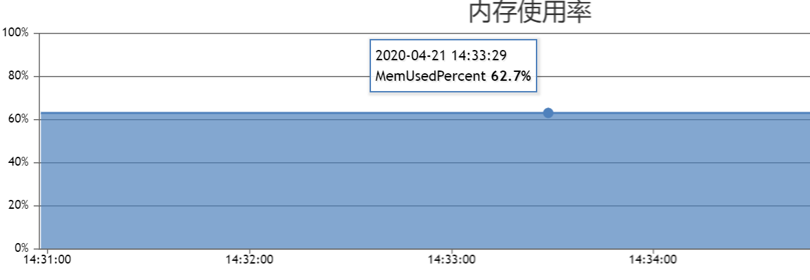
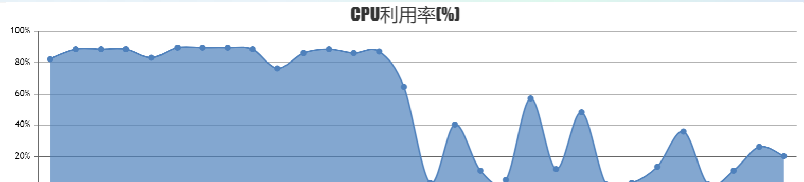
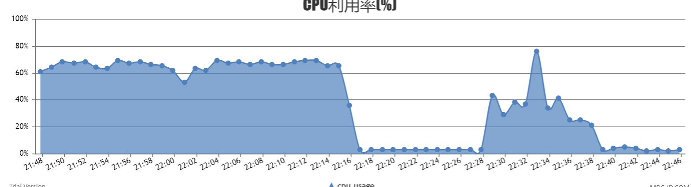
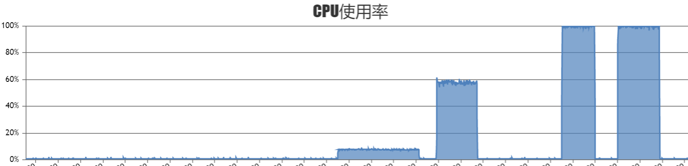

HNSW性能评测
----------------

data_size = 10M, 参数为 InnerProduct, nlinks = 32, efConstruction = 40, efSearch = 64

+-----------------------------------------+-------------+---------+--------------+
|集群                                     |机器配置     |数据维度 |构建索引时间  |
+=========================================+=============+=========+==============+
|master\router\ps各一个，均在一台机器上   |56核256G内存 |128      |28min         |
+-----------------------------------------+-------------+---------+--------------+
|master\router\ps各一个，均在一台机器上   |56核256G内存 |512      |33min10s      |
+-----------------------------------------+-------------+---------+--------------+
|master\router\ps各一台，且在不同机器上   |8核16G内存   |128      |2h38m         |
+-----------------------------------------+-------------+---------+--------------+

**内存使用率**

以8核16G机器为样本进行分析，vearch ps共使用内存16G * 0.627 = 10.032G，其中原始数据特征大小为10M * 128 * 4 ~ 5G，其它为索引以及正排字段占用内存。使用时仅创建一个正排字段和向量字段。

10M数据, 机器配置56核256G，add time = 28min01s, 左侧是构建索引CPU利用率，右侧是搜索时CPU利用率

+------+------------+--------+---------+------+-----+
|model | 返回结果数 | 并发数 | QPS     |tp99  |tp100|
+======+============+========+=========+======+=====+
|HNSW  |  100       |2000    |5069.48  |959   |1944 |
+------+------------+--------+---------+------+-----+
|HNSW  |  100       |1000    |4680.62  |521   |994  |
+------+------------+--------+---------+------+-----+
|HNSW  |  100       |100     |4508.33  |49    |86   |
+------+------------+--------+---------+------+-----+
|HNSW  |  100       |50      |4146.55  |22    |35   |
+------+------------+--------+---------+------+-----+
|HNSW  |  100       |10      |2048.43  |8     |117  |
+------+------------+--------+---------+------+-----+
|HNSW  |  100       |1       |182.74   |9     |160  |
+------+------------+--------+---------+------+-----+

10M数据，机器配置56核256G，d = 512, add time = 33min10s，左侧是构建索引CPU利用率，右侧是搜索时CPU利用率

+------+------------+--------+---------+------+-----+
|model | 返回结果数 | 并发数 | QPS     |tp99  |tp100|
+======+============+========+=========+======+=====+
|HNSW  |  100       |2000    |4194.72  |1181  |2650 |
+------+------------+--------+---------+------+-----+
|HNSW  |  100       |1000    |4058.59  |628   |1059 |
+------+------------+--------+---------+------+-----+
|HNSW  |  100       |100     |3784.56  |57    |172  |
+------+------------+--------+---------+------+-----+
|HNSW  |  100       |50      |3723.75  |24    |43   |
+------+------------+--------+---------+------+-----+
|HNSW  |  100       |10      |1248.46  |15    |1208 |
+------+------------+--------+---------+------+-----+
|HNSW  |  100       |1       |142.70   |12    |71   |
+------+------------+--------+---------+------+-----+

10m数据，机器配置8核16G，d = 128, add_time = 2h38m 

构建索引时CPU使用率基本保持在100%， 搜索时cpu使用率，当并发数为50，100时，可以看到cpu使用率已经100%，故不做并发数1000/2000的对比实验

+-------+------------+--------+---------+------+-------+
| model | 返回结果数 | 并发数 |   QPS   | tp99 | tp100 |
+=======+============+========+=========+======+=======+
| HNSW  | 100        | 100    | 888.25  | 279  |  402  |
+-------+------------+--------+---------+------+-------+
| HNSW  | 100        | 50     | 1126.06 |  95  |  199  |
+-------+------------+--------+---------+------+-------+
| HNSW  | 100        | 10     | 918.50  |  15  |  31   |
+-------+------------+--------+---------+------+-------+
| HNSW  | 100        | 1      |  91.74  |  14  |  25   |
+-------+------------+--------+---------+------+-------+

召回评测使用sift1M 

+-------+---------------------------------------------------------------+----------+-----------+------------+
| model | parameters                                                    | recall@1 | recall@10 | recall@100 |
+=======+===============================================================+==========+===========+============+
| HNSW  | InnerProduct, nlinks = 32, efConstruction = 40, efSearch = 64 |  0.9769  |  0.9852   |   0.9852   | 
+-------+---------------------------------------------------------------+----------+-----------+------------+
